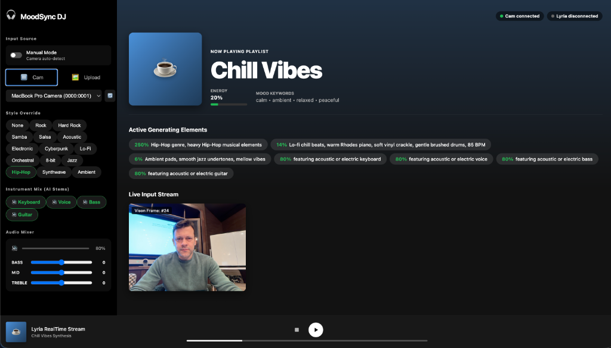

# 🎧 MoodSync DJ 

*Built for the [Gemini 3 NYC Hackathon](https://cerebralvalley.ai/e/gemini-3-nyc-hackathon/details) by Cerebral Valley & Google.*

**MoodSync DJ** is an environment-aware, adaptive music generation application. It leverages the raw multimodal reasoning power of **Gemini 3** to visually analyze your real-world surroundings and directly map that semantic understanding to musical parameters, which are then streamed in real-time by the **Lyria Audio Generation Model**.

If Gemini 3 sees a dimly lit bedroom with rain against the window, you get a lo-fi, chill instrumental beat. If it sees a vibrant party with friends, it shifts the Lyria stream to a high-energy dance track. 



---

## 🌟 Why MoodSync DJ? (Hackathon Focus)

Google asked hackers to push the boundaries of **Gemini 3’s state-of-the-art reasoning** and **rich multimodal understanding**. MoodSync DJ answers that call by:

1. **Multimodal Translation**: It doesn't just describe what it sees—it *interprets* the "vibe" (scene type, energy level, keywords) from your webcam or uploaded images using Gemini 3 Vision capabilities. 
2. **Real-time Parametric Generation**: We use Gemini 3's structured output to dynamically alter Lyria's stream configuration (guidance, brightness, density) and prompt weights on the fly.
3. **Agentic Development**: This entire project was architected, built, and debugged collaboratively using **Antigravity**, Google's new agentic development platform.

## ✨ Features

- **Live Environmental Sync**: Periodically captures frames from your webcam to adapt the music as your environment changes.
- **Static Image Upload**: Upload any picture to instantly generate a custom soundtrack for that exact scene.
- **Manual Override Mode**: Take the wheel and choose from precise scene presets, or aggressively force specific genres (e.g., Cyberpunk, Lofi) and instruments.
- **Lyria RealTime Streaming**: Receives and plays binary audio chunks instantly over WebSockets via the Google `BidiGenerateMusic` API.
- **In-App Mixer**: Fine-tune your audio experience with a custom Web Audio API Equalizer (Bass, Mid, Treble) and volume controls directly in the sidebar.

## 🚀 Getting Started

To run MoodSync DJ locally, you'll need a free Gemini API Key (get one at [aistudio.google.com](https://aistudio.google.com/apikey)).

### 1. Set up Environment Variables
Copy the template file to set your API keys:
```bash
cp .env.template .env
```
Open `.env` and paste your Gemini API key:
```env
VITE_GEMINI_API_KEY="AIzaSy..."
```

### 2. Install Dependencies
```bash
npm install
```

### 3. Run the Development Server
```bash
npm run dev
```

Your app will be live at `http://localhost:5173`. 

---

## 🛠️ Tech Stack

- **Frontend**: React (Vite), native CSS Grid for responsive split-pane layouts.
- **AI Vision / Reasoning**: Gemini 3 (`gemini-3-flash` // `gemini-3-pro`) for zero-shot real-time environmental analysis and structured JSON parsing.
- **AI Audio Stream**: Google Lyria (`BidiGenerateMusic`) WebSocket implementation for continuous PCM16 audio chunk generation.
- **Audio Processing**: Native Web Audio API (`AudioContext`, `BiquadFilterNode`) for the real-time DJ mixer.
- **Built with**: Antigravity (Google DeepMind's agentic platform)

## 🏆 What We Learned

Working with continuous binary audio streams over WebSockets from Lyria requires extremely precise PCM parsing and state management. Coupling that with Gemini 3's instantaneous vision analysis proved that LLMs are finally fast enough to act as the "brain" orchestrating complex, real-time multimedia systems. 
